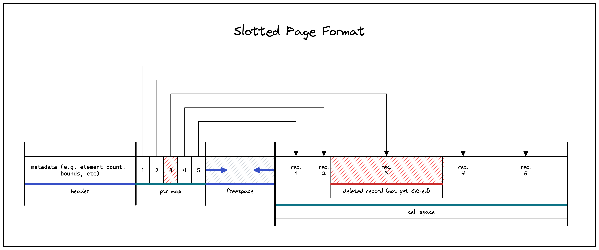

This document describes `fdb`'s file format. s

# Main Concepts and Definitions

The database is stored in a single file, which is divided into pages. Each page
occupies 4 KB (4096 bytes) of size. This value may be parameterized in the
future.

## Page types

- First Page
- Heap Pages

# Structure

- `FirstPage`
  - `MainHeader`
    - (...)
  - `ObjectSchema` first section. Where `ObjectSchema` is defined by:
    - `next_id`, the ID to the next `ObjectSchema` page (see note below).
    - Many `Object`s, where each `Object` is defined by:
      - `type`, the type of the object (e.g. table or index).
      - `page_id`, the ID of the first page which stores data of this object.
      - `name`, the name of the object. For example, the name of an user-defined
        table.
    - > The first entry in the object schema will refer to the `fdb_schema`
      > table, that is be automatically bootstrapped by the database engine.
    - > Since the user may introduce new database objects (i.e., tables,
      > indexes, etc) arbitrarily, the object schema may not fit only in the
      > first page. In such a cases, the `next_id` will point to the next page
      > of the object schema. The object schema file representation is similar
      > to the following user-defined table:
      >
      > ```sql
      > CREATE TABLE fdb_object_schema (
      >     type     byte,
      >     page_id  int,
      >     name     character varying(64),
      >     sql_repr blob,
      > );
      > ```
      >
      > Hence, the database implementation may use the same kind of page used by
      > "regular tables" to store the next pages of the object schema.

Each "data page" is stored as a heap page. Records are stored sequentially and a
record may not surpass the maximum page size.

Pages may be padded with zeroes at the end if the next record doesn't fit into
the page; hence, this record is stored on the next page. In the future, as an
optimization, variable-length fields (such as strings or blobs) will be stored
separately so that this padding doesn't waste much space.

### TODO

Each "data page" (e.g. heap pages used to store tables) are formatted as a
slotted page. E.g.:



Records (arbitrary strings of bytes) are stored in the cell space and may be
freely reordered without affecting external references to it, since such
references points to elements in the pointer section.

Evidently, a pointer in the pointers section may be _removed_. In such cases,
all external references to it must be deleted or marked as so.

### Page sequences and page headers

Heap pages may form a sequence. The first page contains a "global sequence
header", which includes information on the sequence in a general manner. Each
page also has a "local header", which contains information about the current
page (e.g., the ID of the next page in the sequence, etc).

This implementation has a single type for all pages in a given sequence. There
is no difference between, e.g., `FirstHeapPage` and `OrdinaryHeapPage`. Both
types are unified into a single `HeapPage`.

The global header for the sequence is stored in memory as an
`Option<SequenceHeader>`. In the file, the current page sets the first byte as
`1`, which is followed by the actual sequence header bytes. In all other pages
in the sequence, the first byte is `0`, indicating that the page is not the
first.

## Algorithms

The database retrieval process works using an "iterator" model. For example,
when a user performs a query, each row is processed by the system at a time.

### Insertion

The user provides the `table_name` and an environment with record values. This
environment value doesn't need to list all properties expected by the table
schema.

1. Get schema for table `table_name`.
1. Fetch first page for the table schema.
1. Determine the last page in the sequence. This may be the first page.
1. Fetch the last page.
1. Check for space availability. Determine the write-to page.
1. Serialize and write the record in the end of the page.
1. Update control values (in the first page, a potential previous page and the
   current page).
1. Flush changes.

### Selection

The user provides the `table_name`, the fields to be retrieved and a selection
predicate.

1. Get schema for table `table_name`.
1. Fetch first page for the table schema.
1. Set the first page as the current page.
1. While there are "unseen" records in the _sequence_:
   1. If there is not "unseen" records in the _current_ page:
      1. Fetch the next page and set it as the current page.
      1. If there is no next page, throw an unreachable panic.
   2. Read and deserialize the first yet-"unseen" record.
   3. Evaluate predicate for the record.
   4. If the predicate holds, return the record projecting the selected fields.
   5. Otherwise, return a null record.
1. Stop iteration.
